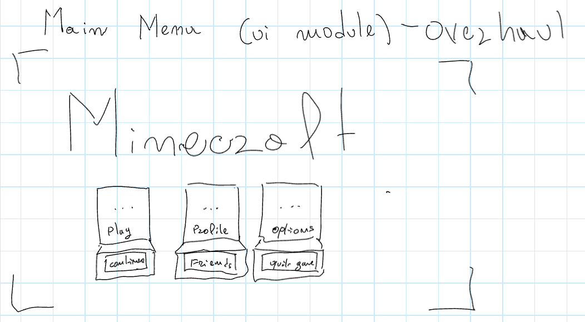
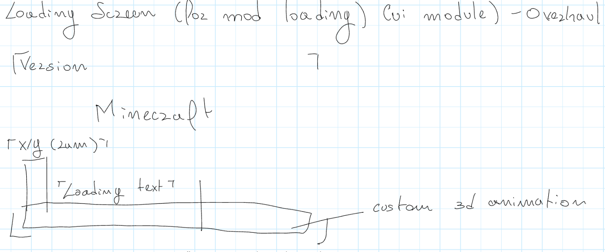
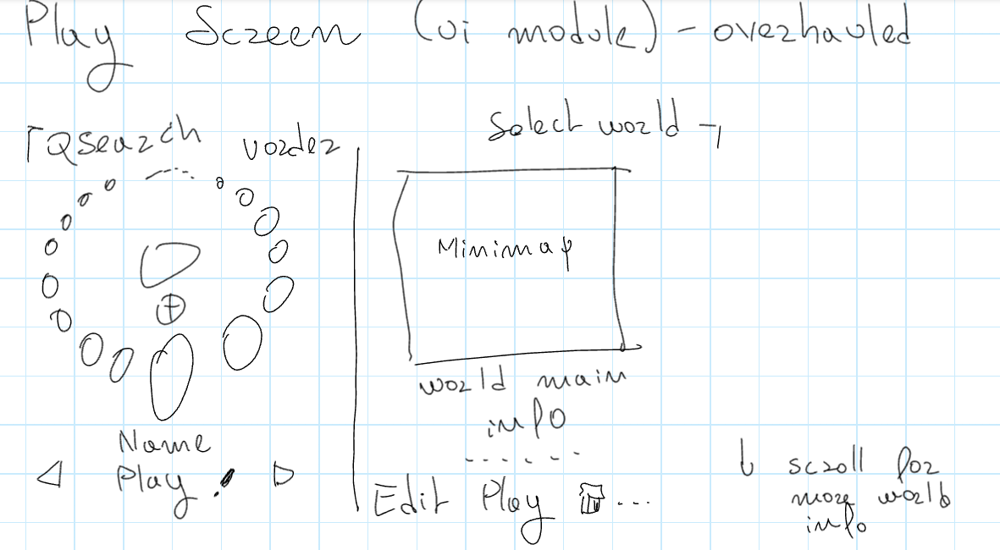
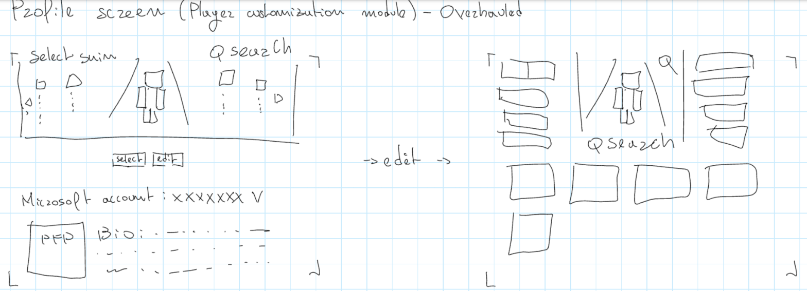
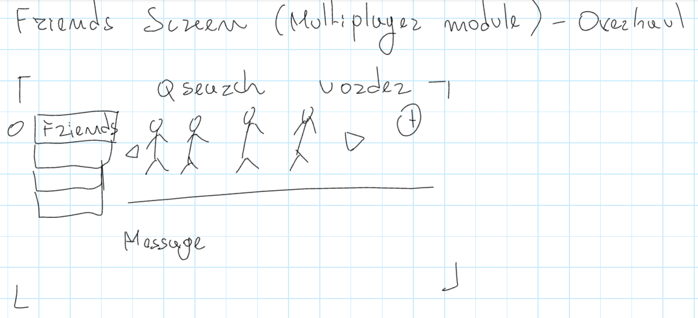
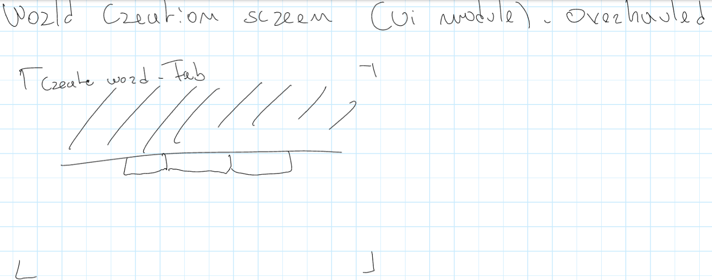
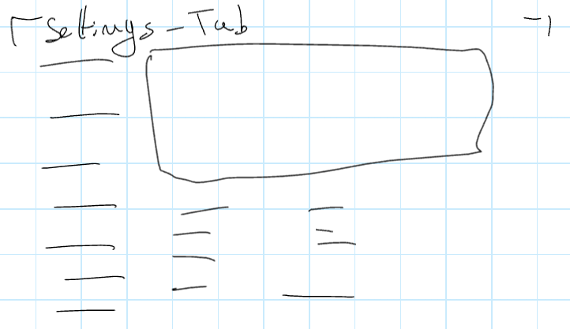

# Slate — layouts design (transcribed)

This is the handwritten design page "Minecraft Slate mod" (OneNote, 28 September 2026), rewritten to be easy to read.
It is only transcribed and organized: nothing was added and nothing was left out. Every sketch is kept as the original
drawing, followed by a text version of it. `(?)` marks a word that was hard to read.

Contents:
1. [Ground rules](#1-ground-rules)
2. [Main menu](#2-main-menu--ui-module--overhaul)
3. [Loading screen (mod loading)](#3-loading-screen-mod-loading--ui-module--overhaul)
4. [Play screen](#4-play-screen--ui-module--overhaul)
5. [Profile screen](#5-profile-screen--player-customization-module--overhaul)
6. [Friends screen](#6-friends-screen--multiplayer-module--overhaul)
7. [World creation screen](#7-world-creation-screen--ui-module--overhaul)
8. [Options screen](#8-options-screen--ui-module--overhaul)

---

## 1. Ground rules

These are the most important things to remember. They are repeated further down where they matter.

### Layouts and styles

- There are **3 layouts**: **Vanilla**, **Custom** and **Overhaul**.
- There are **2 styles**: **Vanilla** and **Slate**.
- **Any combination** of a layout and a style must work.
- A menu that does not exist in vanilla has only the **Custom** and **Overhaul** layouts.
- **Custom** is the layout we already have. **Overhaul** is the new one that this page describes.
- On **first startup**, the player chooses between the 3 layouts and the 2 styles.
  - This choice belongs to the **UI module**, and so does the Custom layout.
  - Without the UI module, every layout is Vanilla. Menus that have no vanilla version use Custom, because they are
    new, non-Minecraft menus.
- In the configs, the layout and the style can be changed **for each menu separately**. New menus have no Vanilla
  layout option there either.

### Modules

| Module | What it does |
|---|---|
| **UI module** | Graphical changes to the menus |
| **Multiplayer module** | Friends and more |
| **Chat module** | Chat rework |
| **Player customization module** | Accounts and skin customization |

- **All modules must work independently.**
- Change the modules, or create new ones, where needed to match this page.
- **Overhaul menus exist only when the UI module is installed.**

### When a module is not installed

- If the module **changes a vanilla menu**, nothing happens.
- If the module **adds a new menu**:
  - in the **Custom** layout, the button for it is removed;
  - in the **Overhaul** layout, the button shows the tooltip **"Install X module to get this feature"**.
- The **Slate style** must still apply to vanilla screens even when the module that edits them is not installed.
- If the **UI module** is not installed, switching between the styles (Vanilla / Slate) must still be possible in
  **each mod's config**. The layout there is Custom anyway, because those menus have no vanilla version.

### Menus

- Every menu on this page needs its **Custom** and **Vanilla** version. A new menu needs no Vanilla layout.
- When adding a new menu, add an **Overhaul** and a **Custom** layout. If the Custom layout is not specified, choose how
  to make it based on what we already have.
- In the **Vanilla** layouts, place the extra buttons the way other mods usually do, so the menus still feel vanilla.
- Even if something is not explicitly asked to be converted to Overhaul, apply the changes you think fit, so that it
  matches the Overhaul style and layout.
- Make sure all the views look like **actual Minecraft**: views like the Friends screen should show an actual world.

### Polish and compatibility

- Improve the Slate style a bit: small things that improve polish.
- **Important:** make sure everything is **well animated** and looks **super polished**.
- **Better Inventory compat:** change its colour palette to the Slate palette currently in use.

> **IMPORTANT: POLISH IS REQUIRED, AND FILL IN THE GAPS.**
> Don't be afraid to touch and edit things so they fit this vision.

---

## 2. Main menu — UI module — Overhaul



Text version of the sketch:

```text
+------------------------------------------------------------+
|  MINECRAFT                                                 |
|                                                            |
|      +-----------+    +-----------+    +-----------+       |
|      |    ...    |    |    ...    |    |    ...    |       |
|      |   Play    |    |  Profile  |    |  Options  |       |
|      +-----------+    +-----------+    +-----------+       |
|      [ Continue  ]    [  Friends  ]    [ Quit game ]       |
|                                                            |
+------------------------------------------------------------+
```

- The big "Minecraft" logo sits at the top left.
- Each box is a chest: the 3D button comes out of its lid, and its sign is at the bottom.

**The scene**

- The main menu is an **animated Minecraft scene with 3 chests** that open.
- **For now**, the scene is just the 3 chests on a **dark background**. The real scene will be made in Minecraft later:
  it has to actually be built in Minecraft.
- The animation is a **cinematic zoom-in**, then the chests **open one by one**.
- Shortly after each chest opens, a **3D animated button** appears in its opened lid.
- The bottom part of each chest has a **clickable sign**, which is also a button.

**The chests**

| Chest | 3D button (in the lid) | Sign (at the bottom) |
|---|---|---|
| 1st | **Play**: a beautiful cube world with clouds all around it. It does a small zoom and an animation when hovered | **Continue** |
| 2nd | **Profile**: simply shows the current player's skin | **Friends** |
| 3rd | **Options**: a Create cogwheel, slowly rotating. It rotates faster for a second when hovered | **Quit game** |

---

## 3. Loading screen (mod loading) — UI module — Overhaul



Text version of the sketch:

```text
+------------------------------------------------------------+
| Version                                                    |
|                                                            |
|            Minecraft                                       |
| X/Y (ram)                                                  |
| +--+  Loading text                                         |
| |  | +-----------------------------------------+           |
| |  | |              conveyor belt              |           |
| +--+ +-----------------------------------------+           |
|                                                            |
+------------------------------------------------------------+
```

- **"Version"** is at the top left, and **"Minecraft"** is the logo.
- **"X/Y (ram)"** is written above the tall container on the far left.
- **"Loading text"** is the text about the current task.
- The long belt along the bottom is labelled **"custom 3d animation"**.

**The scene**

- A Minecraft **conveyor belt scene built with the Create mod**.
- A **final object or container** shows the progress of **crafting items**.
- On the left, a **process** shows the progress of the **current task**. It is also built in the game. Once the task
  finishes, it adds to the final count and resets.
- On the very left, a **vertical lava container** shows **RAM usage**. It is also built in the game.

**Text**

- Text about the **current task** is shown.
- The **precise amount of RAM** used is shown.

---

## 4. Play screen — UI module — Overhaul



Text version of the sketch:

```text
+----------------------------+-------------------------------+
| Search     order           |          Select world         |
|        o   o   .   o       |  +-------------------------+  |
|     o               o      |  |                         |  |
|    o      ( )        O     |  |         Minimap         |  |
|    o      (+)        O     |  |                         |  |
|     O   O  (  )   O        |  +-------------------------+  |
|                            |       world main info         |
|    <      Name       >     |        . . . . . .            |
|           Play (edit)      |  Edit   Play   [trash]  ...   |
+----------------------------+-------------------------------+
```

- **Left half:** the ring of worlds. Small ones are at the back and big ones at the front. A smaller ring and a circled
  "+" are in the middle. The name and "Play" (with a small edit icon) sit under the ring, between the ◁ ▷ arrows.
- **Right half:** "Select world", the minimap, the world's main info, and the Edit / Play / trash / "…" buttons.
- Beside the buttons is the note "↓ scroll for more world info".

> The play screen is a complicated one.

**The worlds ring**

- Worlds are chosen from a **rotating ring**. They get smaller the further back they are.
- A config sets **how many worlds are visible at once**. Scrolling brings new ones in, so any number of worlds can be
  shown.
- Scrolling works by **clicking a world**, with the **left and right arrows**, or with the **mouse wheel**.

**The servers ring**

- A **second, smaller ring** shows at the center.
- Clicking it makes the current ring shrink out, and the new ring expands to replace it.
- That ring holds the **servers**. It works exactly the same way, and it has its own inner ring. That inner ring goes
  back to the worlds, with the same animation.

**How entries look**

- Each world or server looks just like the **Play button's cube world**.
- Each one is **procedurally generated**, so it looks slightly different from the others.
- Some **defining feature** should make servers look different from worlds.

**Around the ring**

- **Below the ring:** a play button, the world name, and small edit icons.
- **Top left:** a search bar.
- **Top:** a choice of sorting order for the worlds.
- **Favourites:** a little star favourites a world or server. Favourites always appear first.

**When a world or server is selected** (right half):

- If **JourneyMap or Xaero's map** is installed, show an **interactive minimap**.
- Below it, show the **main details**. Scrolling shows the rest.
- Below those are an **edit** button, a **play** button, a **trash** icon, and **3 dots** for more (clone, etc.).

---

## 5. Profile screen — Player customization module — Overhaul



Text version of the sketch, first the normal view:

```text
+--------------------------------------------------+
| Select skin                         Search       |
|                                                  |
|  <   o    o    \  (player)  /    o    o   >      |
|                 \  under   /                     |
|                  \ light  /                      |
|              [select]  [edit]                    |
|                                                  |
| Microsoft account: XXXXXXX v                     |
| +-----+  Bio: .............................      |
| | PFP |       .............................      |
| +-----+       .............................      |
+--------------------------------------------------+
```

Then, after **→ edit →**, the edit view:

```text
+--------------------------------------------------+
|  [    ]     \  (player)  /   (magnifier)  [    ] |
|  [    ]      \  under   /                 [    ] |
|  [    ]       \ light  /                  [    ] |
|  [    ]         Search                    [    ] |
|  [    ]  [    ]  [    ]  [    ]                  |
|  [    ]                                          |
+--------------------------------------------------+
```

- In the normal view, the other looks sit smaller on either side of the one in the spotlight, with ◁ ▷ arrows.
- In the edit view:
  - a column of slots on each side;
  - the player in the spotlight, with a magnifier icon at its top right and "Search" under it;
  - a row of boxes below.

**Looks and skins**

- The profile screen brings some fun features.
- You can **create and scroll through multiple looks/skins**. To create one, just move to a **blank one**, which shows
  a **default Minecraft Steve/Alex**.
- **Left and right arrows** switch between them.
- The look currently in view has a nice-looking **3D shining light**, so the whole preview feels like a **stage**.
- The **selected** look shines brighter, and its light shines even when it is not in view.

**Account and profile**

- A **Microsoft account switcher** (the little "v").
- A **profile picture (PFP)** selector and swapper.
- A **bio**.
- These, and the skins, **save to the PC** and work across **any instance and any version**.

**Editing a skin**

- When a skin is being edited, the other looks animate out. In their place come buttons to **edit parts of the body**
  and to **add accessories**.
- **On the left:** an **upload base skin** option, and other buttons to edit the **left/right legs and arms**, and
  **pets (?)**.
- **On the right:** buttons for **accessories**, such as shirts, pants, back accessories, hats, etc.
- Clicking one of these **zooms in on that body part** and shows the list of **available items, rendered in 3D**.
- A little button at the **top right of the player preview** turns the zoom off entirely.
- **Make a sample item for everything**, for testing, and make sure it **works in multiplayer** too.

---

## 6. Friends screen — Multiplayer module — Overhaul



Text version of the sketch:

```text
+----------------------------------------------------------+
|                 Search          order              (+)   |
| o [ Friends ]   <   P    P    P    P    >                |
|   [         ]     --------------------------             |
|   [         ]     Message                                |
|   [         ]                                            |
+----------------------------------------------------------+
```

- **P** is a friend, standing on the ground line. Two of them are drawn moving.
- The tabs are on the left, with a small circle beside the "Friends" tab.
- The "+" is at the top right.

**Streams**

- **Drop the streams features**, unless they are turned on in the mod's config.

**Tabs**

- **4 tabs on the left:** **Friends**, **Messages**, **Groups** and **Requests**.
- Also have a **Screenshots** tab here.
- The same **search and order selectors** as in the worlds screen.

**Friends tab**

- Friends are shown **in a Minecraft world**. Online friends are **standing**; offline friends are **sitting**.
- **2 arrows** show more friends to the left or right.
- Every friend has their **name and status** shown above them.
- **Clicking a friend** selects them and shows their info and **buttons below**.
- A **"+" button** on the right adds friends.

**Groups tab**

- A similar view, but with the players **sitting around a campfire**.

**Everything else**

- Be creative in choosing how to polish the rest, including the other tabs.

---

## 7. World creation screen — UI module — Overhaul



Text version of the sketch:

```text
+----------------------------------------------+
| Create world - Tab                           |
|   //////////////////////////////////////     |
|   ///////// hatched area (preview) /////     |
|   //////////////////////////////////////     |
|  ------------------------------------------  |
|          [ tab ][ tab ][ tab ]               |
|                                              |
|                                              |
+----------------------------------------------+
```

- The hatched area at the top is the world preview.
- Three tabs hang under the line below it.
- The selected tab's content fills the rest of the screen.

**Layout**

- The screen shows a **view that is a preview of the world**.
- A simple button **minimizes** the preview.
- The **tabs for world creation** are below it.

---

## 8. Options screen — UI module — Overhaul



Text version of the sketch:

```text
+----------------------------------------------+
| Settings - Tab                               |
|  ---   +----------------------------------+  |
|  ---   |                                  |  |
|  ---   +----------------------------------+  |
|  ---      -------          -------           |
|  ---      -------          -------           |
|  ---      -------          -------           |
+----------------------------------------------+
```

- The column of lines on the left is the list of tabs.
- The wide box at the top is the in-game window.
- The option rows are below it, in two columns.

**Main tabs**

1. General
2. Video
3. Controls
4. Audio
5. Multiplayer
6. Interface
7. Language and accessibility ("Accessibility")
8. Customization (mods / resource packs / shaders)
9. Advanced

**How it should feel**

- Everything should feel **polished and intuitive**.
- **Advanced** configs stay on the page that opens when you click **Advanced**.
- Tabs can have **horizontal sub-tabs**.

**What each tab needs**

- **General** and **Video** have a **real in-game window** above them when the player is inside a world. A simple
  button minimizes it.
- **Controls** must give **easy access**, plus **controller compatibility** if the mod for it is installed.
- **Audio** has **device switching**, and the **voice chat settings** too.
- **Multiplayer** has **chat, friends settings and more**.
- **Interface** keeps what it has now, and adds **style and layout toggles for each menu** the mod touches, and for
  **containers** in general. A general version of these toggles is what shows when the game starts for the first time.
- **Everything else** should mostly stay the same. Work out the rest yourself.
